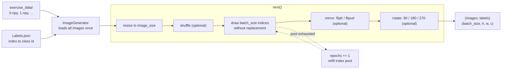

# Pattern Generation and Data Handling

Synthetic test patterns and a batching image loader, written from scratch in NumPy — the data layer for a four-part deep learning framework.


No deep learning libraries are used anywhere in this series — no PyTorch, no TensorFlow, no Keras. Every layer, optimizer and data path is implemented directly on NumPy arrays.

## Part of a series

A NumPy-only deep learning framework built up over four repositories, each one extending the last:

1. **Pattern Generation and Data Handling** — *this repository*. Synthetic patterns and the batch loader that feeds everything downstream.
2. [FullyConnectedNeuralNetwork](https://github.com/husseinsaeid85-hue/FullyConnectedNeuralNetwork) — the base framework: fully connected layers, ReLU, SoftMax, cross-entropy loss, SGD.
3. [NeuralNetFramework-CNN](https://github.com/husseinsaeid85-hue/NeuralNetFramework-CNN) — convolutional extension: convolution, pooling, flattening and weight initializers.
4. [Regularization-RecurrentNN](https://github.com/husseinsaeid85-hue/Regularization-RecurrentNN) — dropout, batch normalization, weight constraints, and recurrent layers with TanH/Sigmoid activations.

This repository is the foundation: it produces the deterministic patterns used to sanity-check a network's data path, and the batch/label pipeline that supplies training input.

## Pattern generation

`pattern.py` builds three deterministic patterns as NumPy arrays. Every class shares the same interface — construct with geometry parameters, call `draw()` to build and return the array, call `show()` to render it with matplotlib.

| Class | Constructor | Output |
|---|---|---|
| `Checker` | `Checker(resolution, tile_size)` | `(resolution, resolution)` float array of 0.0 / 1.0 |
| `Circle` | `Circle(resolution, radius, centers)` | `(resolution, resolution)` boolean disc mask |
| `Spectrum` | `Spectrum(resolution)` | `(resolution, resolution, 3)` float array in `[0, 1]` |

- **Checker** tiles a 2x2 block of alternating squares across the canvas, starting black in the top-left. The resolution must be an integer multiple of twice the tile size; otherwise `draw()` reports that the pattern cannot be tiled evenly and returns the zero-initialised output.
- **Circle** evaluates the circle equation over a `meshgrid` coordinate grid, so the whole mask is produced in one vectorised comparison rather than a pixel loop. `centers` is an `(x, y)` pixel coordinate.
- **Spectrum** builds an RGB gradient from three linear ramps: red increasing left to right, green increasing top to bottom, blue decreasing left to right. Its `output` is populated during construction.

```python
from pattern import Checker, Circle, Spectrum

checker = Checker(100, 10)          # 100x100 canvas, 10px tiles
array = checker.draw()              # -> (100, 100) ndarray
checker.show()                      # render with matplotlib

circle = Circle(1000, 200, (400, 600))   # resolution, radius, (x, y) centre
mask = circle.draw()                     # -> (1000, 1000) boolean ndarray

spectrum = Spectrum(2500)           # resolution
spectrum.show()                     # uses the array built at construction
```

## The ImageGenerator data pipeline

`generator.py` contains `ImageGenerator`, which turns a directory of images plus a JSON label file into an endless stream of training batches.

Images are individual `.npy` arrays named by their integer index (`0.npy`, `1.npy`, …). The label file maps those same indices, as strings, to integer class ids:

```json
{"45": 1, "24": 9, "15": 9, "23": 7, "9": 5}
```

Files are sorted by numeric filename at load time, so an image's position in memory matches its key in the label file. All images are read into memory once during construction.



### Behaviour

- **Batching.** Sampling is without replacement within an epoch. Each `next()` call draws `batch_size` indices from the pool of indices not yet used; when fewer than `batch_size` remain, the batch is topped up with samples reused from the start of the epoch, the epoch counter advances, and the pool refills. Batches are therefore always full-sized.
- **Epoch tracking.** `current_epoch()` returns how many complete passes over the dataset have been made.
- **Class names.** `class_name(label)` maps an integer class id to a readable name via the built-in ten-class mapping (`airplane`, `automobile`, `bird`, `cat`, `deer`, `dog`, `frog`, `horse`, `ship`, `truck`).
- **Reproducibility.** `next()` reseeds NumPy's global RNG at the start of each call, so a given configuration replays the same batch sequence from run to run.

### Usage

```python
from generator import ImageGenerator

gen = ImageGenerator(
    file_path='exercise_data',   # directory of .npy images
    label_path='Labels.json',    # index -> class id mapping
    batch_size=10,
    image_size=[32, 32, 3],      # [height, width, channels]
    rotation=False,
    mirroring=False,
    shuffle=True,
)

images, labels = gen.next()      # -> (10, 32, 32, 3) and (10,)
print(gen.current_epoch())       # -> 0
print(gen.class_name(labels[0])) # -> e.g. 'frog'

gen.show()                       # plot the next batch with class-name titles
```

## Sample data

`data.zip` (291 KB) holds the sample dataset the generator reads. Unpack it in the repository root before running the generator:

```bash
unzip data.zip
```

It contains:

- `exercise_data/` — 100 files, `0.npy` through `99.npy`, each a `(32, 32, 3)` `uint8` RGB image.
- `Labels.json` — a flat mapping of image index to class id in the range 0–9.

The images and the ten class names correspond to a CIFAR-10 subset. This is sample data provided with the original coursework, kept in the repository so the demo runs out of the box.

## Structure

```
PatternGenDataHandler/
├── pattern.py         Checker, Circle and Spectrum pattern generators
├── generator.py       ImageGenerator: batching, resizing, augmentation
├── main.py            Demo: renders each pattern, then one labelled batch
├── data.zip           Sample dataset (100 images + Labels.json)
├── requirements.txt
├── LICENSE            MIT
└── README.md
```

## Getting started

```bash
git clone https://github.com/husseinsaeid85-hue/PatternGenDataHandler.git
cd PatternGenDataHandler
pip install -r requirements.txt
unzip data.zip
python main.py
```

`main.py` renders the checkerboard, circle and spectrum patterns in turn, then loads a batch through `ImageGenerator` and plots it with class-name titles. Each pattern opens in its own matplotlib window; close it to advance to the next.

`scikit-image` is listed in `requirements.txt` for parity with the original setup instructions, but no module in this repository imports it — only NumPy and matplotlib are needed to run the code.

## License

Released under the [MIT License](LICENSE).
